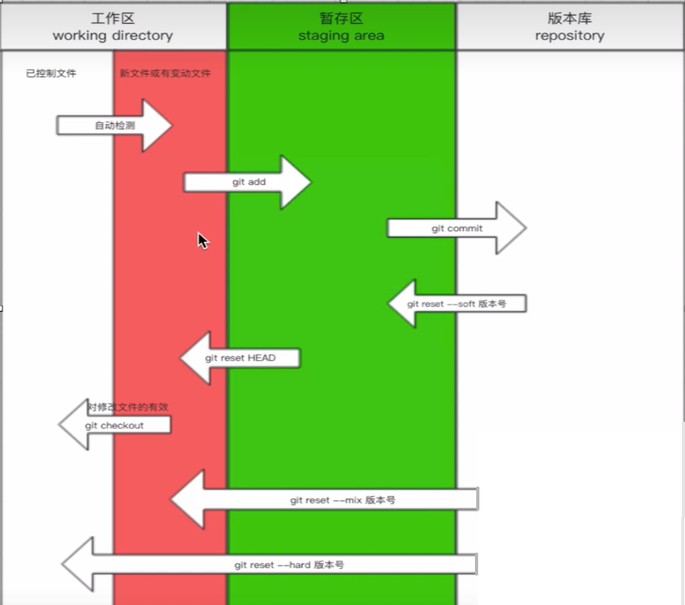

# Git是什么？

分布式版本控制的软件

* 软件：安装到电脑上的工具

* 版本控制：

  * 文件拷贝：论文 -> 版本通过文件来控制，多个文件，不同的标注来确定各个阶段的版本

  * 本地版本控制：只有一个文件，但是通过本地控制软件可以追溯以前的所有版本（类似游戏存档），相比文件拷贝，视觉上不会存在多个文件过于冗杂，但实际上不能解决协同开发或者多台设备开发

  * 集中式版本控制：多个设备可以通过一个中心来共同访问和操作开发的文件

    ```
    PC1 -> 
    		CENTER	->	FILES{version1, version2 ...}
    PC2 -> 
    ```

    代表软件：SVN

    缺点：无法离线提交，失去连接后无法再本地进行版本开发

  * 分布式版本控制：仓库（中心）只向本地提供一个版本，是一个文件的形式，当仓库挂掉或者断联，不影响本地对文件的修改

    ```
    PC1{version1} -> 
    					HUB{version1, version2}	
    PC2{version2} ->
    ```

    本地提交的时候，先提交到本地的仓库，然后在推到中心，所以即使离线，仍可以上传代码

    代表软件：git

# 为什么要做版本控制

* 防止线上代码出现问题，需要回滚，一行命令就可以解决
* 对于大量功能的项目，方便管理

# 下载安装Git

安装git的设备：本地计算机，中心无需安装，事实上，所谓的中心一般是由网站来执行，例如github、gitee

## Windows安装

下载网站
[Git - 安装 Git (git-scm.com)](https://git-scm.com/book/zh/v2/起步-安装-Git)

下载链接

https://github.com/git-for-windows/git/releases/download/v2.44.0.windows.1/Git-2.44.0-64-bit.exe

安装完毕后鼠标右键桌面，会显示`git bash here`和`git gui here`两个选项，说明安装成功

查看安装版本`git --version`

```
$ git --version
git version 2.44.0.windows.1
```

# Git做版本控制的步骤

即，让git管理文件夹（以`dbhot`为例）

## 1.进入要管理的文件夹

## 2.初始化

* 在对应的文件夹中，右键选择`Git Bash Here`

* 输入`git init`进行初始化

  ```
  $ git init
  Initialized empty Git repository in C:/Users/X/Desktop/Study/libraryMIS/Git/dbhot/.git/
  ```

  执行后，文件夹下会出现一个`.git`的文件

## 3.管理

* 检测当前文件夹下文件的状态`git status`

```
$ git status
On branch master
  
No commits yet
  
Untracked files:
  (use "git add <file>..." to include in what will be committed)
        index.html
        advert.docx
  
nothing added to commit but untracked files present (use "git add" to track)
```

### 添加到git的管理项目中

  添加一个文件到管理`git add 文件名`

  ```
  $ git add advert.docx
  ```

  再检测文件夹下文件状态

  ```
  $ git status
  On branch master
  
  No commits yet
  
  Changes to be committed:
    (use "git rm --cached <file>..." to unstage)
          new file:   advert.docx
  
  Untracked files:
    (use "git add <file>..." to include in what will be committed)
          index.html
  ```

  执行add的文件被标记为绿色，而未执行的仍为红色

  **一键管理当前文件夹的所有文件`git add .`**

  ```
  $ git add .
  ```

## 4.生成版本

  ### 生成第一个版本

  `git commit -m '描述信息'`

  ```
  $ git commit -m "v1"
  ```

  如果提示

  ```
  Author identity unknown
  
  *** Please tell me who you are.
  
  Run
  
    git config --global user.email "you@example.com"
    git config --global user.name "Your Name"
  
  to set your account's default identity.
  Omit --global to set the identity only in this repository.
  
  fatal: unable to auto-detect email address (got 'X@DESKTOP-CKCOG1F.(none)')
  ```

  需要先配置用户

  ```
  git config --global user.email "you@example.com"
  ```

  ```
  git config --global user.name "Your Name"
  ```

  执行结果

  ```
  $ git commit -m "v1"
  [master (root-commit) 8ce9c96] v1
   2 files changed, 1 insertion(+)
   create mode 100644 advert.docx
   create mode 100644 index.html
  ```

  运行`git status`

  ```
  $ git status
  On branch master
  nothing to commit, working tree clean
  ```

### 生成后续版本  

修改文件的内容保存后，再运行`git status`

  ```
  $ git status
  On branch master
  Changes not staged for commit:
    (use "git add <file>..." to update what will be committed)
    (use "git restore <file>..." to discard changes in working directory)
          modified:   index.html
  
  no changes added to commit (use "git add" and/or "git commit -a")
  ```

  modified: index.html

  表示这个文件被检测到修改

  * 再执行`git add .`将所有未被管理的文件添加到管理中
  * 再执行`git commit -m "v2"`生成第二个版本

### 查看版本历史  

通过`git log`可以访问所有的版本记录

  ```
  $ git log
  commit 028636097e57c62ea86e6fa7603c2fe11682804c (HEAD -> master)
  Author: Gin49SZ <1003690614@qq.com>
  Date:   Sat Mar 9 10:53:28 2024 +0800
  
      v2
  
  commit 8ce9c967d86beca44488239d3681fb2ad6405e15
  Author: Gin49SZ <1003690614@qq.com>
  Date:   Sat Mar 9 10:44:10 2024 +0800
  
      v1
  ```

## 总结

1.进入要管理的目录

2.`git init`	让git管理当前的文件夹

3.`git status`	检测当前目录下文件的状态

4.三种状态变化：

* 红色：新增的文件/修改了原来的旧文件 -> `git add 文件名`或者`git add .`
* 绿色：git以及管理起来了 -> `git commit -m "描述信息"`
* 生成版本

## 补充：个人的配置、创建文件、关闭分页器

信息配置：用户名、邮箱

生成版本时候需要记录对应修改者的用户名和邮箱

```
git config --global user.email "xxx@yy.com"
```

```
git config --global user.name "zzz"
```

**仅需执行一次即可**

另外，创建一个文件，默认是未被管理的状态

```
git touch 文件名.文件扩展名
```

页面出现长内容，以(END)结尾，关闭分页器 -> 按下Q键即可

# Git的三大区域

工作区、暂存区、版本库

```
工作区
已管理 | 新文件/修改后的文件	（自动检测）

=>git add 提交到暂存区

暂存区
确定是否提交，也可以回滚

=>git commit 提交到版本库

版本库
生成最终版本
```

# 回滚

当提交一个版本的时候，查看版本信息时，作者上方commit后面的一串序列号即为版本号

```
commit 8ce9c967d86beca44488239d3681fb2ad6405e15
Author: Gin49SZ <1003690614@qq.com>
Date:   Sat Mar 9 10:44:10 2024 +0800

    v1
```

版本号：8ce9c967d86beca44488239d3681fb2ad6405e15

回滚代码：`git reset  --hard 版本号`

```
$ git reset --hard 028636097e57c62ea86e6fa7603c2fe11682804c
HEAD is now at 0286360 v2
```

库中文件全部变为v2时候的状态，再执行`git log`的时候，不再显示v2之后的版本

```
$ git log
commit 028636097e57c62ea86e6fa7603c2fe11682804c (HEAD -> master)
Author: Gin49SZ <1003690614@qq.com>
Date:   Sat Mar 9 10:53:28 2024 +0800

    v2

commit 8ce9c967d86beca44488239d3681fb2ad6405e15
Author: Gin49SZ <1003690614@qq.com>
Date:   Sat Mar 9 10:44:10 2024 +0800

    v1
```

**如何回滚至v2之后的状态？**

查看版本变化的历史`git reflog`

```
$ git reflog
0286360 (HEAD -> master) HEAD@{0}: reset: moving to 028636097e57c62ea86e6fa7603c2fe11682804c
f601e35 HEAD@{1}: commit: v3
461e45e HEAD@{2}: commit: v3
0286360 (HEAD -> master) HEAD@{3}: commit: v2
8ce9c96 HEAD@{4}: commit (initial): v1
```

其中，各个版本的版本号即为最左侧的序列号，只需根据对应的版本号重新执行`git reset --hard 版本号`即可

```
$ git reset --hard f601e35
HEAD is now at f601e35 v3
```

# 命令总结&补充

```
git init
git add
git commit
git log
git reflog
git reset --hard 版本号

----------------------------------------

git checkout -- 文件名		撤回对该文件的所有修改(工作区：修改或新文件 -> 已经控制文件)
git reset HEAD 文件名		将暂存区的文件撤回到工作区(已修改或新文件状态)
```



# 分支

git中，不同的版本之间，**v2和v1之间并不是v2是在v1直接拷贝之上增加内容的关系**，而是v2只保留了新增或者修改记录的内容（类似于快照）

原理：改变的文件会有一个指向未改变文件的指针，当生成版本的时候，只需要根据指针找到未改变代码，并添加上改变的内容即可

```
demo.txt| v0.1 <- p| modified| v0.2 <- ... <- p| modified| v0.9
```

因此可以存在多个版本，通过指针指向一个前驱版本

```
<-p| modified| v0.6 <- p1| modified| v0.61
				  ^
				  |_ p2| modified| v0.62
```

## 紧急修复处理思路

根据分支的概念，当在开发v0.6时候，v0.5出现紧急BUG，可以先创建一个基于v0.5的分支用于紧急修复BUG，然后可以基于v0.6继续开发

```
<-p| modified| v0.5 <- p| add new func| v0.61 <- p| unite| v0.6 (合并到主干线)
(主干线 master)	^								  |	
				  |_ p| fix BUG emergency| v0.51 <--|
				  (分支 dev <名称可以自定义>)
```

## 紧急修复过程

查看目前所在的分支`git branch`

```
$ git branch
* master
```

创建一个分支`git branch 分支名`

```
$ git branch dev
```

查看自己所在的分支，目前还是在master(带有*的就是目前所在的)

```
$ git branch
  dev
* master
```

进入分支`git chekout 分支名`

```
$ git checkout dev
Switched to branch 'dev'
```

查看自己所在的分支，即dev

```
$ git branch
* dev
  master
```

修改文件内容(即开始紧急修复BUG) -> 添加到暂存区 -> 提交到版本库

查看分支版本(HEAD -> dev)

```
$ git log
commit b878250bf310366006a6932704d8c656f8d5476a (HEAD -> dev)
Author: gin49sz <1003690614@qq.com>
Date:   Sat Mar 9 20:51:00 2024 +0800

    C4
```

修改完毕(BUG修复完毕)，切换回master`git checkout master`

```
$ git checkout master
Switched to branch 'master'
```

创建bug分支

```
git branch bug
git checkout bug
git add .
git commit -m "C5"
```

一般情况下，认为master为线上分支，即正在运行使用的分支，所以要将bug分支合并到master中

合并分支

* 第一步，切换回master`git checkout master`

* 第二步，合并bug分支`git merge bug`

  ```
  $ git merge bug
  Updating 7152ba0..27a986e
  Fast-forward
   index.html | 3 ++-
   1 file changed, 2 insertions(+), 1 deletion(-)
  ```

* 第三步，删除bug分支`git branch -d bug`

  ```
  $ git branch -d bug
  Deleted branch bug (was 27a986e).
  ```

* 第四步，回到开发分支`git checkout dev`

* 第五步，将开发的新功能合并到master，直接合并可能会引起冲突错误（在同一行添加或者修改的代码）

  ```
  $ git merge dev
  Auto-merging index.html
  CONFLICT (content): Merge conflict in index.html
  Automatic merge failed; fix conflicts and then commit the result.
  ```

  手动选择选择保留的内容即可

* 第六步，提交合并内容

  * `git add .`
  * `git commit -m "C7"`

# 命令总结

* 查看分支

  ```
  git branch
  ```

* 创建分支

  ```
  git branch 分支名称
  ```

* 切换分支

  ```
  git checkout 分支名称
  ```

* 分支合并(可能会产生冲突)

  ```
  git merge 要合并的分支
  
  注意：切换分支再合并
  ```

* 删除分支

  ```
  git branch -d 分支名称
  ```

# 工作流

开发时候一般至少要有两个分支

* dev分支：版本的更替都在dev分支上进行，负责开发功能
* master分支：只保留正式版本


