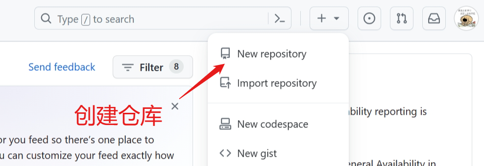
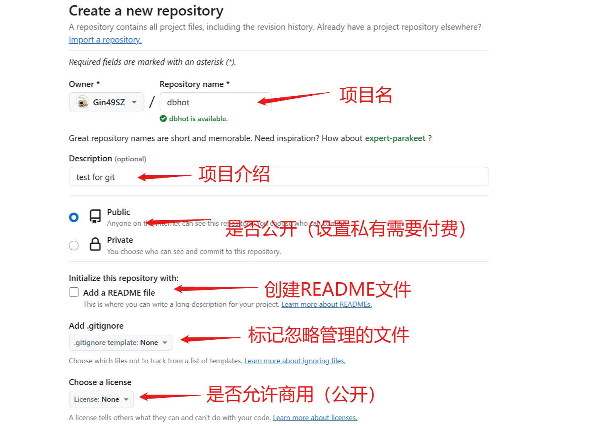
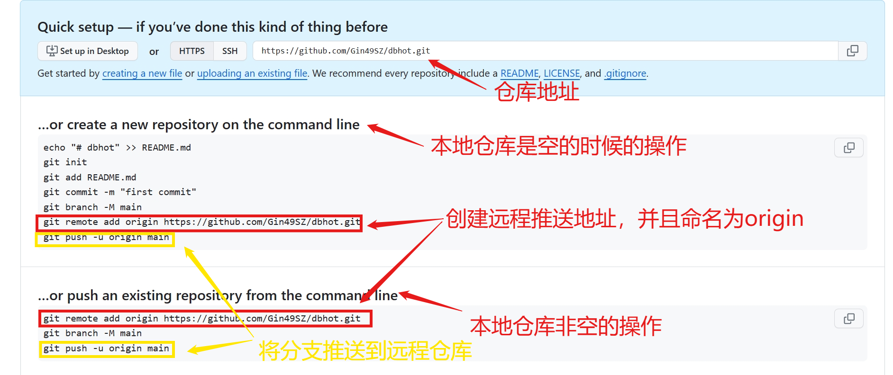
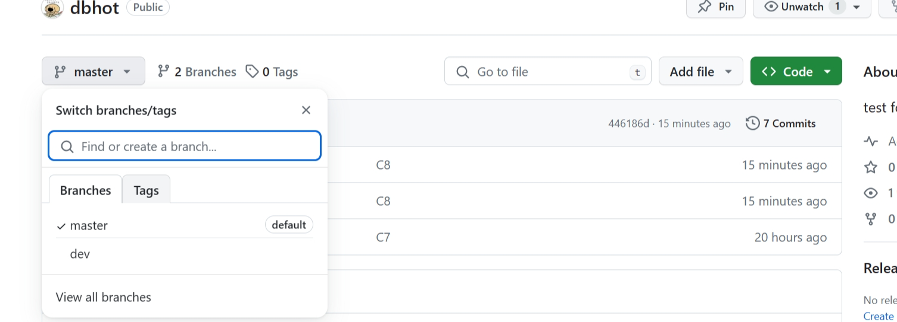
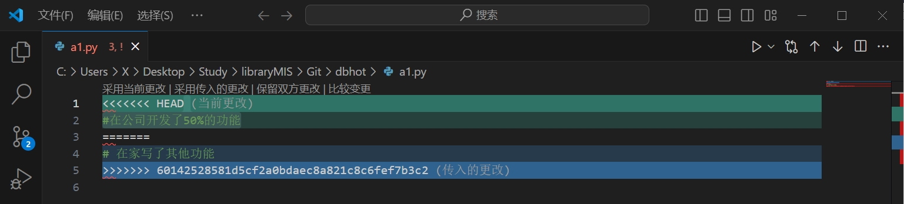
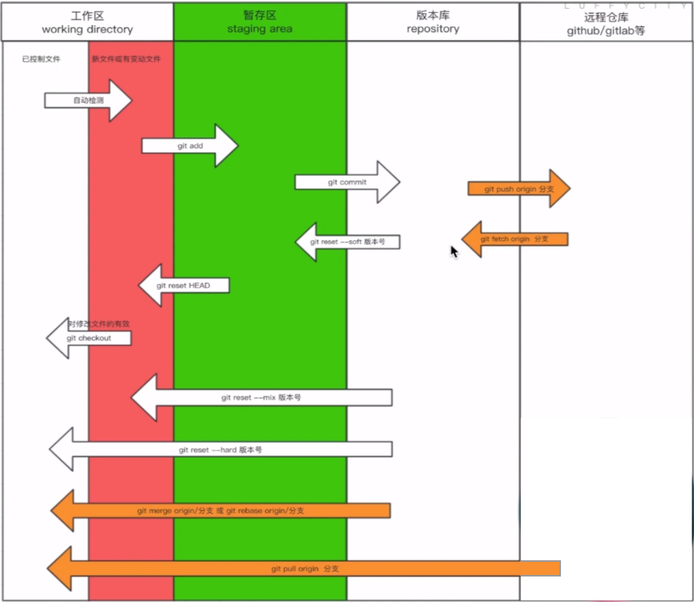

# GitHub是什么？

做代码仓库，代码托管的仓库，类似功能的还有CSDN、GitLab等

使用步骤

## 创建账号

## 创建仓库

### 第一步



### 第二步



## 将本地代码推送到远程仓库



`git branch -M main`表示将主线命名为main

实际使用提交直接执行以下即可推送master分支

```
git remote add origin https://github.com/Gin49SZ/dbhot.git
git push -u origin master
```

推送dev分支

```
git push -u origin dev
```



## 本地下载远程仓库的代码

在本地可以通过`git clone`将远程仓库的代码全部下载到本地

```
$ git clone https://github.com/Gin49SZ/dbhot.git
Cloning into 'dbhot'...
remote: Enumerating objects: 22, done.
remote: Counting objects: 100% (22/22), done.
remote: Compressing objects: 100% (8/8), done.
remote: Total 22 (delta 1), reused 22 (delta 1), pack-reused 0
Receiving objects: 100% (22/22), 1.00 MiB | 1.29 MiB/s, done.
Resolving deltas: 100% (1/1), done.
```

注意：下载远程仓库的代码后查看分支，只有一个master分支

```
$ git branch
* master
```

虽然没有显示，但是仍可以切换到其他分支

```
$ git checkout dev
Switched to a new branch 'dev'
branch 'dev' set up to track 'origin/dev'.

$ git branch
* dev
  master
```

## 总结

本地代码推送远端，给远程仓库起别名

```
git remote add origin https://...
```

向远程推送代码

```
git push -u origin 分支
```

克隆远程仓库代码

```
git clone https://...(内部已经实现起别名)
```

# 开发流程

在**原开发的环境**中，将master合并到dev分支上，从而实现dev分支的版本是当前主线的版本

```
git checkout dev

git merge master
```

假设添加了新功能a1(创建了新文件)

```
touch a1.py	
```

将新开发的功能提交到远程仓库

```
git add .

git commit -m "在公司开发第一天的代码"

git push origin dev		(手动)
```

如果报错443timeout，检查是否能连接到github

```
ssh -T git@github.com

输入yes
```

回到**其他开发环境**，对于更新的远程仓库下载到本地，如果使用`git clone`会下载全部的代码

更新本地的代码与远程仓库相同`git pull`

```
git pull origin dev
```

假设在**其他开发环境**中添加了新功能a2.py

```
touch a2.py
```

将新开发的功能提交到远程仓库

```
git add .

git commit -m "在家里开发了a2功能"

git push origin dev	
```

回到**原开发环境**，与远程仓库同步

```
git pull origin dev
```

## 模拟场景：在家和公司进行项目开发

在家里上传代码

```
1.给远程仓库起别名
	git remote add origin 远程仓库地址
2.向远程仓库推送代码（使用默认方式）
	git push -u origin 分支
```

到公司新电脑上第一次获取代码

```
1.克隆远程仓库代码
	git clone 远程仓库地址（内部已经实现git remote add origin 远程裆裤地址）
2.切换分支
	git checkout 分支
```

在公司进行开发

```
1.切换到dev分支进行开发
	git checkout dev
2.把master分支合并到dev
	git merge master
3.修改代码
4.提交代码
	git add .
	git commit -m "xx"
	git push origin dev
```

回到家中继续写代码

```
1.切换到dev分支进行开发
	git checkout dev
2.拉代码
	git pull origin dev
3.继续开发
4.提交代码
	git add .
	git commit -m "xx"
	git push origin dev
```

在公司继续开发

```
1.切换到dev分支进行开发
	git checkout dev
2.拉代码
	git pull origin dev
3.继续开发
4.提交代码
	git add .
	git commit -m "xx"
	git push origin dev
```

开发完毕要上线

```
1.将dev分支合并到master，进行上线
	git checkout master
	git  merge dev
	git push origin master

2.把dev分支也推送到远程
	git checkout dev
	git merge master
	git push origin dev
```

**关于一些timeout报错的解决方法**

```
1.取消代理
git config --global --unset http.proxy

2.关闭密钥查询
git config --globale http.sslVerify "false"
```

## pull代码冲突解决

假设在公司开发某个功能到50%没有push

```
git commit -m "在公司开发50%因事耽搁"
```

在家中没有公司50%代码的情况下继续开发

```
git commit -m "在家开发了一些其他功能"

git push origin dev
```

第二天在公司拉代码会出现冲突

```
$ git pull origin dev
remote: Enumerating objects: 7, done.
remote: Counting objects: 100% (6/6), done.
remote: Compressing objects: 100% (2/2), done.
remote: Total 4 (delta 0), reused 4 (delta 0), pack-reused 0
Unpacking objects: 100% (4/4), 443 bytes | 11.00 KiB/s, done.
From https://github.com/Gin49SZ/dbhot
 * branch            dev        -> FETCH_HEAD
   61c86f2..6014252  dev        -> origin/dev
Auto-merging a1.py
CONFLICT (content): Merge conflict in a1.py
Automatic merge failed; fix conflicts and then commit the result.
```

`CONFLICT (content): Merge conflict in a1.py`表示a1在合并的时候产生了冲突

在公司打开a1.py



采用`保留双方更改`的方式解决冲突并推到线上

```
git add .
git commit -m "合并之后开发完毕"
git push origin dev
```

## 总结

```
git pull origin dev

等同于两个命令
git fetch origin dev	将代码从远程仓库拉到本地的版本库
git merge origin/dev	将版本库的最新代码更新到工作区
```



# Rebase（变基）

可以让代码的提交记录变得简洁

## 功能1：多个记录整合成1个

假设目前有v1, v2, v3, v4四个版本

```
$ git log
commit 013eae8b51aec0615d94c4bb6cb64d60dec6d541 (HEAD -> master)
Author: Gin49SZ <1003690614@qq.com>
Date:   Mon Mar 11 10:36:58 2024 +0800

    v4

commit 4fe046350d024c7c750f9e34927e4d248d22b14a
Author: Gin49SZ <1003690614@qq.com>
Date:   Mon Mar 11 10:36:41 2024 +0800

    v3

commit 65837622cb944abd506c8dda5fe8bdfbd9357c79
Author: Gin49SZ <1003690614@qq.com>
Date:   Mon Mar 11 10:36:25 2024 +0800

    v2

commit 78b1844bd924e39b7cf42328cfd4eaa0b5573e5d
Author: Gin49SZ <1003690614@qq.com>
Date:   Mon Mar 11 10:35:58 2024 +0800

    v1
```

通过`git rebase`来完成合并

* 方式1：`git rebase -i 版本号`，表示从当前版本到最新版本合并

  * 当版本号为v2的版本号，表示合并v2, v3, v4
  * 当版本号为v3的版本号，表示合并v3, v4

* 方式2：`git rebase -i HEAD~合并项数`，表示从当前记录开始找最近的三个记录合并

  * 当前在v4版本，合并项数为3，表示合并v4, v3, v2，执行后会有如下提示

    ```
    pick 6583762 v2
    pick 4fe0463 v3
    pick 013eae8 v4
    
    # Rebase 78b1844..013eae8 onto 78b1844 (3 commands)
    #
    # Commands:
    # p, pick <commit> = use commit
    # r, reword <commit> = use commit, but edit the commit message
    # e, edit <commit> = use commit, but stop for amending
    # s, squash <commit> = use commit, but meld into previous commit
    # f, fixup [-C | -c] <commit> = like "squash" but keep only the previous
    #                    commit's log message, unless -C is used, in which case
    #                    keep only this commit's message; -c is same as -C but
    #                    opens the editor
    # x, exec <command> = run command (the rest of the line) using shell
    # b, break = stop here (continue rebase later with 'git rebase --continue')
    # d, drop <commit> = remove commit
    # l, label <label> = label current HEAD with a name
    # t, reset <label> = reset HEAD to a label
    # m, merge [-C <commit> | -c <commit>] <label> [# <oneline>]
    #         create a merge commit using the original merge commit's
    #         message (or the oneline, if no original merge commit was
    #         specified); use -c <commit> to reword the commit message
    # u, update-ref <ref> = track a placeholder for the <ref> to be updated
    #                       to this position in the new commits. The <ref> is
    #                       updated at the end of the rebase
    #
    # These lines can be re-ordered; they are executed from top to bottom.
    #
    # If you remove a line here THAT COMMIT WILL BE LOST.
    #
    # However, if you remove everything, the rebase will be aborted.
    #
    ~
    .git/rebase-merge/git-rebase-todo[+] [unix] (10:45 11/03/2024)           3,2 All
    ```

  * 将v3和v4前面的`pick`改为`s`，`s`表示与上一个版本合并，v3和v4修改为s表示将v3和v4合并到v2中

    ```
    pick 6583762 v2
    s 4fe0463 v3
    s 013eae8 v4
    ```

  * 按下ESC退出编辑模式，输入`:wq`保存并退出，弹出以下内容来提交提示信息

    ```
    # This is a combination of 3 commits.
    # This is the 1st commit message:
    
    v2
    
    # This is the commit message #2:
    
    v3
    
    # This is the commit message #3:
    
    v4
    
    # Please enter the commit message for your changes. Lines starting
    # with '#' will be ignored, and an empty message aborts the commit.
    #
    # Date:      Mon Mar 11 10:36:25 2024 +0800
    #
    # interactive rebase in progress; onto 78b1844
    # Last commands done (3 commands done):
    #    squash 4fe0463 v3
    #    squash 013eae8 v4
    # No commands remaining.
    # You are currently rebasing branch 'master' on '78b1844'.
    #
    # Changes to be committed:
    #       new file:   2.py
    #       new file:   3.py
    #       new file:   4.py
    #
    ~
    .git/COMMIT_EDITMSG [unix] (10:49 11/03/2024)                            4,1 All
    <p/Study/libraryMIS/Git/rebase/.git/COMMIT_EDITMSG" [unix] 30L, 641B
    ```

  * 修改合并版本的提示信息（在`message`和`please`之间），然后保存并退出（同上）

    ```
    ...
    # This is the 1st commit message:
    
    v2 & v3 & v4
    
    # Please enter the commit message for your changes. Lines starting
    ...
    ```

  * 合并后的log

    ```
    $ git log
    commit 8a2b68398c54f4b242324d8e691f4f0aa6389d75 (HEAD -> master)
    Author: Gin49SZ <1003690614@qq.com>
    Date:   Mon Mar 11 10:36:25 2024 +0800
    
        v2 & v3 & v4
    
    commit 78b1844bd924e39b7cf42328cfd4eaa0b5573e5d
    Author: Gin49SZ <1003690614@qq.com>
    Date:   Mon Mar 11 10:35:58 2024 +0800
    
        v1
    ```

**注意：**合并的版本最好是**没有提交到远程仓库的版本**，最好不要和已经push到仓库的记录合并

## 功能2：合并分支

假设在开发v1的时候出现了v1.1和v1.2两个版本，但两个版本都是基于v1开发，然后又最终合并到v2版本中

```
v1 <- p | modified| v1.1 <- p |update | v2
	^						 |
	|_ p | func_pack| v1.2 <-|
```

通过rebase可以将多条分支归并到一条上

```
v1 <- p | func_pack| v1.2 <- p | modified| v1.1 <- p |update | v2
```

* 方式

  * 查看流程，通过`git log --graph`可以查看图状的流程

    ```
    $ git log --graph
    *   commit 6a435b8663998556b52a0b72593cd03aafaec9f8 (HEAD -> master)
    |\  Merge: 51f3253 377960a
    | | Author: Gin49SZ <1003690614@qq.com>
    | | Date:   Mon Mar 11 11:15:43 2024 +0800
    | |
    | |     merge dev to master
    | |
    | * commit 377960aef53b72f615adc249385d0b292087a4e1 (dev)
    | | Author: Gin49SZ <1003690614@qq.com>
    | | Date:   Mon Mar 11 11:13:21 2024 +0800
    | |
    | |     dev branch
    | |
    * | commit 51f325393945e7b30f26b0e6b97a602af0f3aec3
    |/  Author: Gin49SZ <1003690614@qq.com>
    |   Date:   Mon Mar 11 11:15:06 2024 +0800
    |
    |       master funciton
    |
    * commit 8a2b68398c54f4b242324d8e691f4f0aa6389d75
    | Author: Gin49SZ <1003690614@qq.com>
    | Date:   Mon Mar 11 10:36:25 2024 +0800
    |
    |     v2 & v3 & v4
    |
    * commit 78b1844bd924e39b7cf42328cfd4eaa0b5573e5d
      Author: Gin49SZ <1003690614@qq.com>
      Date:   Mon Mar 11 10:35:58 2024 +0800
    
          v1
    ```

    通过`git log --graph --pretty=format:"%h %s"`可以显示最主要的信息

    ```
    $ git log --graph --pretty=format:"%h %s"
    *   6a435b8 merge dev to master
    |\
    | * 377960a dev branch
    * | 51f3253 master funciton
    |/
    * 8a2b683 v2 & v3 & v4
    * 78b1844 v1
    ```

  * 在此基础上，为dev和master添加新的内容，并执行`git rebase`来将分支合并到master中

    ```
    git checkout dev
    touch dev1.py
    git add .
    git commit -m "dev branch commit 1"
    
    git checkout master
    touch master1.py
    git add .
    git commit -m "master 1"
    
    git checkout dev
    git rebase master
    
    git checkout master
    git merge dev
    ```

    查看记录图会发现，不再有分支

    ```
    $ git log --graph --pretty=format:"%h %s"
    * a862ef4 dev branch commit 1
    * 35d5ece master 1
    *   6a435b8 merge dev to master
    |\
    | * 377960a dev branch
    * | 51f3253 master funciton
    |/
    * 8a2b683 v2 & v3 & v4
    * 78b1844 v1
    ```


## 功能3：合并远程仓库的代码不产生分支

当公司有代码未上传，家里写了一些代码上传后，公司想拉云端的代码，会产生分支（pull代码冲突）

```
$ git log --graph --pretty=format:"%h %s"
*   aaca90c 合并之后并开发完毕
|\
| * 6014252 在家开发了一些其他功能
* | ea7435c 因事耽搁，只开发50%的功能
|/
* 61c86f2 开发完毕
```

如何不产生分支？`git fetch`然后再`git rebase`

```
git pull origin dev -> git fetch origin dev
					   git rebase origin/dev
```

## 注意事项

### rebase产生冲突

* 修改dev和master的同一个文件

* 将master的内容合并到dev中，`git rebase`产生冲突中断

  ```
  $ git rebase master
  Auto-merging 1.py
  CONFLICT (content): Merge conflict in 1.py
  error: could not apply 149aff8... x1
  hint: Resolve all conflicts manually, mark them as resolved with
  hint: "git add/rm <conflicted_files>", then run "git rebase --continue".
  hint: You can instead skip this commit: run "git rebase --skip".
  hint: To abort and get back to the state before "git rebase", run "git rebase --abort".
  Could not apply 149aff8... x1
  ```

* 解决冲突

* 按照提示执行`git add`等操作

  ```
  $ git add 1.py
  ```

* 执行`git rebase --contine`继续执行rebase

  ```
  $ git rebase --continue
  [detached HEAD 0ab51ad] x1
   1 file changed, 2 insertions(+)
  Successfully rebased and updated refs/heads/dev.
  
  $ git log --graph --pretty=format:"%h %s"
  * 0ab51ad x1
  * 3972c5c master xxx
  * a862ef4 dev branch commit 1
  * 35d5ece master 1
  *   6a435b8 merge dev to master
  |\
  | * 377960a dev branch
  * | 51f3253 master funciton
  |/
  * 8a2b683 v2 & v3 & v4
  * 78b1844 v1
  ```

  冲突解决且没有产生分支

# 高效处理冲突

## 安装Beyond Compare

使用软件可以更加高效地处理冲突——**Beyond Compare**

官网下载地址`www.beyondcomparepro.com/download`

## 在git中进行配置

`--local`表示配置仅对当前项目有效

```
git config --local merge.tool bc4(合并工具名，可随意)
git config --local mergetool.bc4.cmd "\"C:\\Program Files\\Beyond Compare 4\\BComp.exe\" \" (软件地址)
git config --local mergetool.keepBackup false (解决冲突无需保存备份)
```

## 应用软件解决冲突

```
$ git mergetool 
```


选择完毕后也可以手动编辑内容，最后点击右边的**保存**按钮即可解决冲突

# 总结

* 添加远程连接

  ```
  git remote add origin 地址
  ```

* 推送代码

  ```
  git push origin dev
  ```

* 下载代码

  ```
  git clone 地址
  ```

* 拉代码

  ```
  git pull origin dev
  
  等价于
  git fetch origin dev
  git merge origin/dev
  ```

* rebase = merge (可以保持提交记录更加简洁)(变基)

  ```
  git rebase 分支
  ```

* 记录图形展示

  ```
  git log --graph --pretty=format:"%h %s"
  ```

  


