# 多人协作

如何实现多人协作，共同开发一个项目，每个人负责一些功能？

**为每个人创建一个dev分支，或者以每个人负责的功能为命名创建dev分支（git flow工作流）**

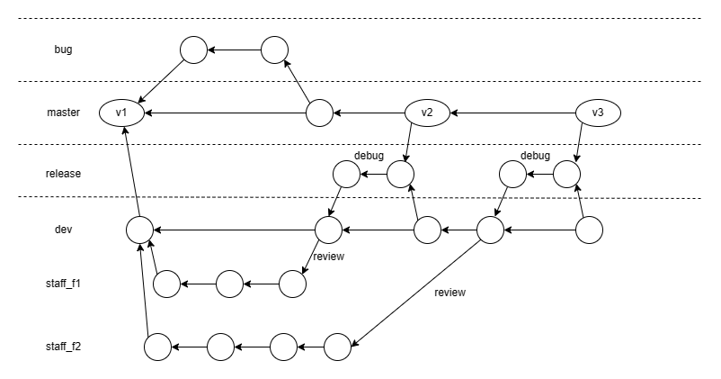

## 在GitHub中添加合作者

### 1.个人添加

在仓库的settings选项中，选择collaborators选项

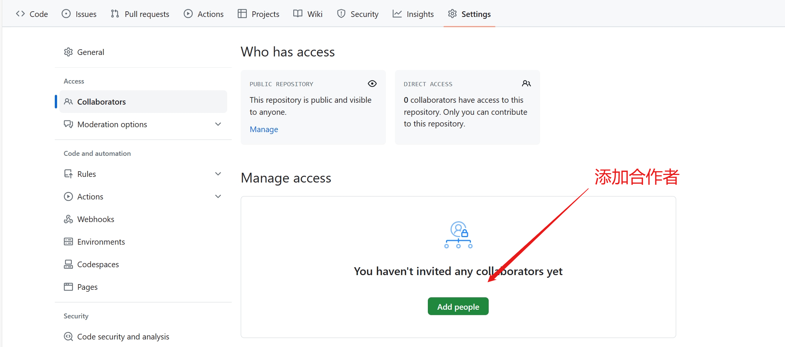

### 2.组织添加

创建一个组织

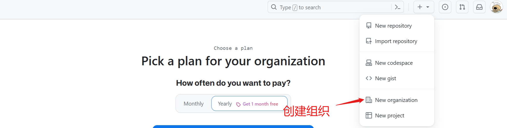

设置组织的一系列信息后即可创建完毕，无需邀请其他成员，直接继续即可进入组织界面

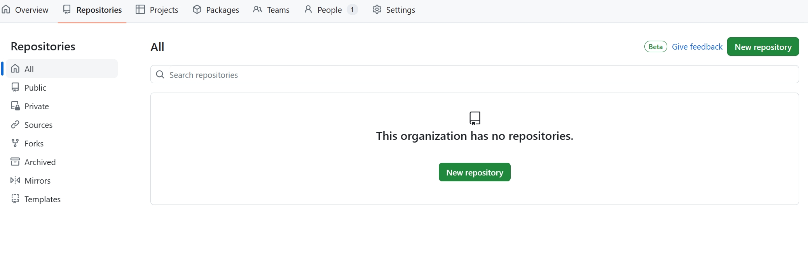

新建一个组织项目dbhot，然后推送第一个版本

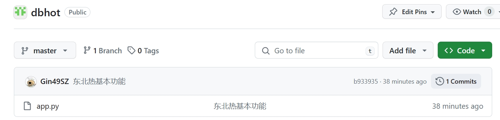

版本名称应该是v1.0之类而不是具体的描述，如何添加对应的版本号？

使用`git tag`**添加Tag**

```
$ git tag -a v1 -m "第一版"

$ git log
commit b933935d4bf99eb8a665fb36b1a88e924ae756a9 (HEAD -> master, tag: v1, origin/master)
Author: Gin49SZ <1003690614@qq.com>
Date:   Mon Mar 11 18:12:56 2024 +0800

    东北热基本功能

```

将tags推到远程仓库

```
$ git push origin --tags 
```

通过点击`tag`即可查看对应的版本

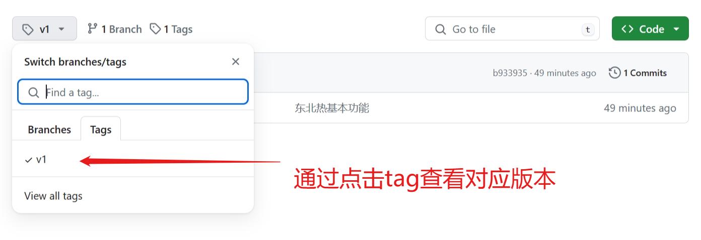

可以通过点击`tags`可以查看标签和release版本

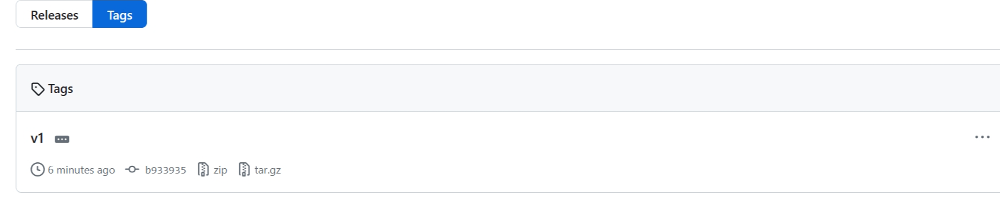

## 多人协作实例

创建dev并切换到dev

```
git checkout -b dev
```

* 邀请成员进组织 invite member 
  * member：成员
  * owner：管理员
  
* 管理不同成员对项目的权限
  * 点击仓库的settings
  * 在Collaborators and teams中邀请对应的成员
  * 点击edit修改成员的权限

* 成员创建自己的分支ddz并进行开发

  ```
  git checkout -b ddz
  
  touch 斗地主.py
  
  vim 斗地主.py
  
  git add .
  
  git commit -m "斗地主功能开发完毕"
  
  git push origin ddz
  ```

## 代码review

  * 应不应该做：应该

  * 由谁来做：team leader

  * 如何做：用GitHub上的pull request来实现，需要一些配置

    * 在项目的settings中找到Branches菜单项

    * 点击`add branches protection rule`添加规则，勾选pull request前面的确认

      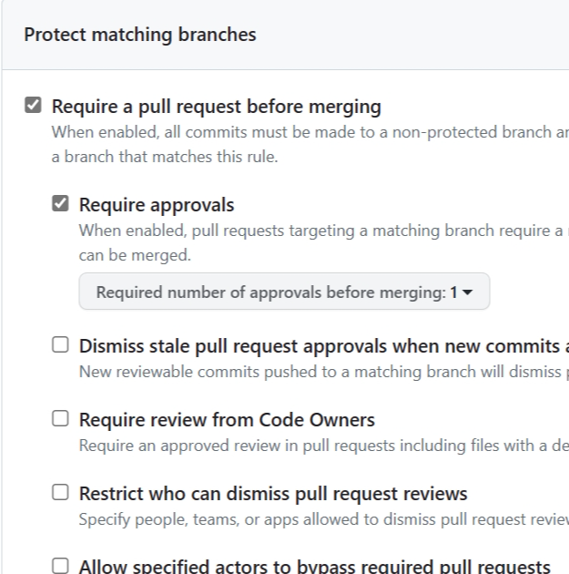

    * 点击create创建规则，之后想要和dev合并的代码必须经过review才可以

  * 成员点击`compare & pull request`创建pull request

    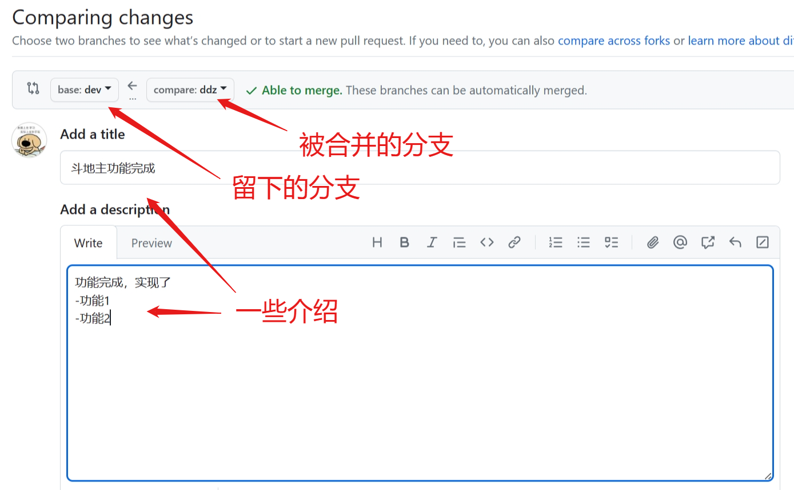

  * 之后代码会被发给leader

    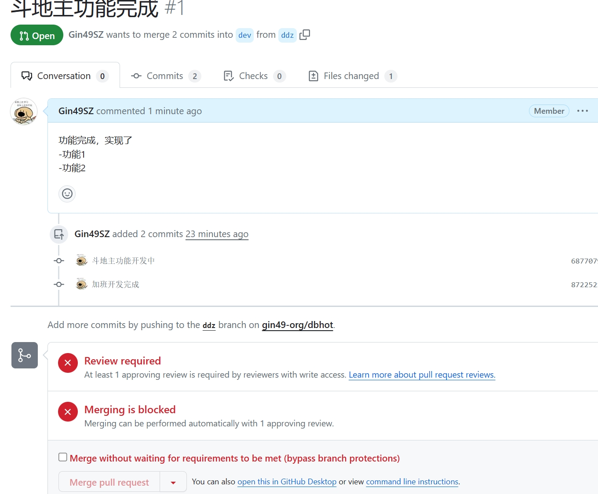

  * 小组Owner进入Pull request界面即可查看到review

    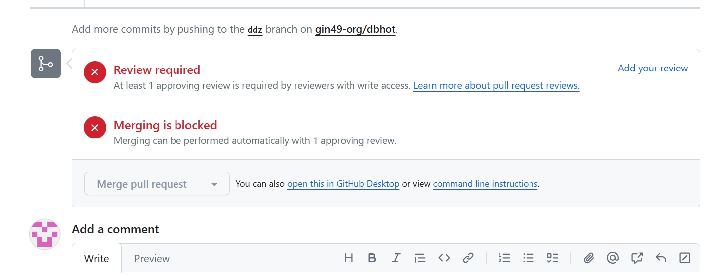

  * 点击`Add your review`即可添加review

    


  * Owner通过提交review或者approved即可通过review，之后合并会变成允许状态，点击合并后即可将ddz分支合并到dev

* 合并成功后，会提示可以删除对应的分支，点击delete branch即可删除，之后Code界面就不会有ddz分支

  

## 测试和上线

dev上的内容与master合并需要提出测试，并通过测试

进入release分支的项目不会再添加新功能，主要用于测试BUG

将release版本提交到master版本再做一次review(操作见上)，通过即可正式上线

* 添加测试分支

  ```
  git branch -b release
  ```

* 在GitHub中提交pull request，创建review通过，合并release到master中

* 在GitHub中删除release分支

* 在本地将release分支合并到dev中

  ```
  git checkout dev
  
  git merge release
  ```

* 删除release分支

  ```
  git branch -d release
  ```

* 将GitHub的master分支pull到本地

  ```
  git checkout master
  
  git pull origin master
  ```

* 为上线的内容添加tag

  ```
  git tag -a v2 -m "第二版 增加斗地主功能"
  
  git push origin --tags
  ```

* 在GitHub查看tag，有两个标签

  ```
  v2
  v1
  ```

# 给开源项目贡献代码

对现有开源项目提供的建议以及代码被采纳，是一件非常值得技术人员自豪的事情，如果您发现某个项目出现一些bug或者有一些方面功能改进的建议，如何实现向开源项目贡献代码呢

1.fork源代码

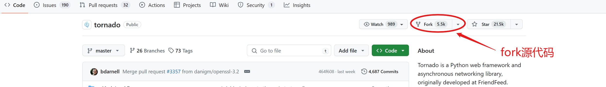

将别人的源代码拷贝到自己的远程仓库

2.在自己的仓库进行修改代码，并提交到自己的仓库

3.给源代码作者提交修复bug的申请（pull request）

点击new pull request生成一个pull request, create之后就可以把意见或者代码提交给原作者

# 其他小知识点

## 配置文件

* 项目配置文件：项目/.git/config，`git config --local `只在当前项目生效

  ```
  git config --local user,name 'xxx'
  git config --local user.emial 'yyy'
  ```

* 全局配置文件：~/.gitconfig\

  ```
  git config --global user,name 'xxx'
  git config --global user.emial 'yyy'
  ```

* 系统配置文件：/etc/.gitconfig

  ```
  git config --system user,name 'xxx'
  git config --system user.emial 'yyy'
  
  注意：需要有root权限
  ```

应用场景：

```
git config --local user,name 'xxx'
git config --local user.emial 'yyy'

git config --local merge.tool bc4
git config --local mergetool.bc4.cmd "\"C:\\Program Files\\Beyond Compare 4\\BComp.exe\" \"
git config --local mergetool.keepBackup false

git remote add origin 地址 默认添加在本地配置文件中(--local)
```

## 免密登录

- URL中体现

  ```
  原来的地址：https://github.com/xxx/yyy.git
  修改的地址：https://用户名:密码@github.com/xxx/yyy.git
  ```

- SSH实现

  ```
  1.生成公钥和私钥(默认放在 ~/.ssh目录下，id_rsa.pub公钥、id_rsa私钥)
  	ssh-keygen
  2.拷贝公钥的内容，并设置到github中
  	cat ~/.ssh/id_rsa.pub -> 复制 -> GitHub -> settings -> SSH and GPG keys ->new SSH -> add SSH
  3.在git本地中配置ssh地址
  	git remote add origin SSH协议地址(Code -> Local -> SSH)
  4.以后使用
  	git push origin master 无需使用密码
  ```

- git自动管理凭证，基于操作系统做的凭证

## git忽略文件

假设目前有a.py, b.py, c.py三个文件，当git管理时候会全部一并管理，如何实现屏蔽某个文件？

```
vim .gitignore
```

在`.gitignore`中输入要忽略的文件`a.py`，即可在git中屏蔽该文件

在`.gitignore`中输入*+忽略文件的扩展名`*.py`，即可在git中屏蔽所有的`.py`格式文件

在`.gitignore`中输入`.gitignore`，这个文件也不会在git中显示

在`.gitignore`中输入`files/`，名叫files的文件夹下的所有文件都会被忽略

在`.gitignore`中输入`!a.py`，除了`a.py`之外的所有文件都会被忽略

在`.gitignore`中输入`!files/`，除了名叫files的文件夹下的所有文件，其他文件都会被忽略

在GitHub中搜索`gitignore`可以查看排除某种语言的写好的`.gitignore`

## 任务管理

- issues，文档以及任务管理。
- wiki，项目文档。


