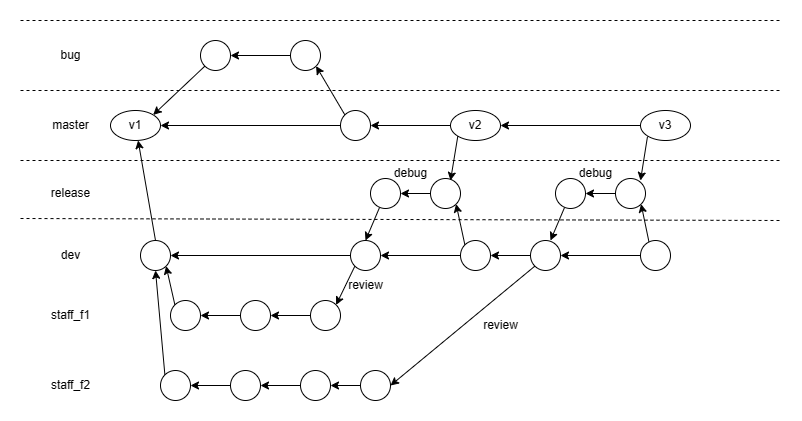
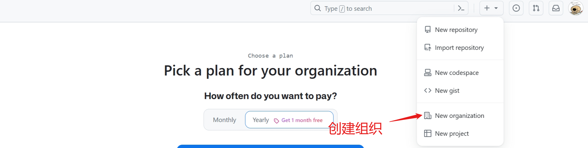
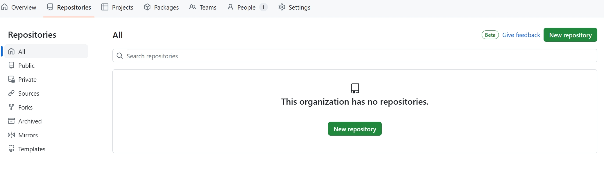
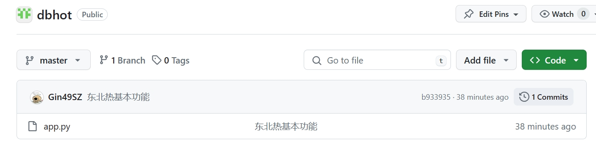

# 多人协作

如何实现多人协作，共同开发一个项目，每个人负责一些功能？

**为每个人创建一个dev分支，或者以每个人负责的功能为命名创建dev分支（git/flow工作流）**



## 在github中添加合作者

### 1.个人添加

在仓库的settings选项中，选择collaborators选项


### 2.组织添加

创建一个组织



设置组织的一系列信息后即可创建完毕，无需邀请其他成员，直接继续即可进入组织界面



新建一个组织项目dbhot，然后推送第一个版本



版本名称应该是v1.0之类而不是具体的描述，如何添加对应的版本号？

使用`git tag`**添加Tag**

```
$ git tag -a v1 -m "第一版"

$ git log
commit b933935d4bf99eb8a665fb36b1a88e924ae756a9 (HEAD -> master, tag: v1, origin/master)
Author: Gin49SZ <1003690614@qq.com>
Date:   Mon Mar 11 18:12:56 2024 +0800

    东北热基本功能

```

将tags推到远程仓库

```
$ git push origin --tags 
```

通过点击`tag`即可查看对应的版本


可以通过点击`tags`可以查看标签和release版本


## 多人协作实例

创建dev并切换到dev

```
git checkout -b dev
```

* 邀请成员进组织 invite member 
  * member：成员
  * owner：管理员
* 管理不同成员对项目的权限
  * 点击仓库的settings
  * 在Collaborators and teams中邀请对应的成员
  * 点击edit修改成员的权限

* 成员创建自己的分支ddz并进行开发

  ```
  git checkout -b ddz
  
  touch 斗地主.py
  
  vim 斗地主.py
  
  git add .
  
  git commit -m "斗地主功能开发完毕"
  
  git push origin ddz
  ```

* 代码review

  * 应不应该做：应该

  * 由谁来做：team leader

  * 如何做：用github上的pull/request来实现，需要一些配置

    * 在项目的settings中找到Branches菜单项

    * 点击`add branches protection rule`添加规则，勾选pull&request前面的确认

      

    * 点击create创建规则，之后想要和dev合并的代码必须经过review才可以

  * 成员点击`compare & pull request`创建pull request

    

  * 之后代码会被发给leader

    

  * 小组Owner进入Pull request界面即可查看到review

    

  * 点击`Add your review`即可添加review
  
    
  
  
  * Owner通过提交review或者approved即可通过review，之后合并会变成允许状态，点击合并后即可将ddz分支合并到dev
  
* 删除ddz分支，合并成功后，会提示可以删除对应的分支，点击delete branch即可删除，之后Code界面就不会有ddz分支

  
